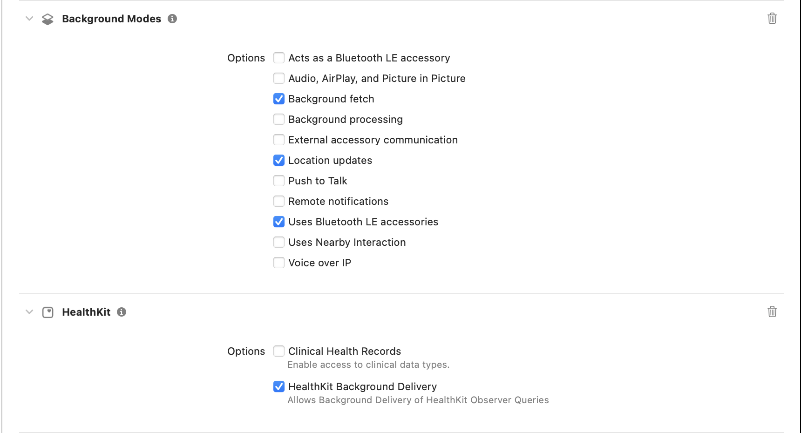

# KoolingSDK

A lightweight iOS SDK for location tracking and activity monitoring. Perfect for apps that need to track user trips and provide analytics.

## 📋 Requirements

- iOS 15.0+
- Swift 5.0+
- Xcode 13.0+

## 📦 Installation

### Swift Package Manager

Add KoolingSDK to your project using Swift Package Manager:

```swift
dependencies: [
    .package(url: "https://github.com/Kooling-Tech/SDK_iOS", from: "1.0.0")
]
```

Or add it directly in Xcode:
1. File → Add Package Dependencies
2. Enter URL: `https://github.com/Kooling-Tech/SDK_iOS`
3. Select version: `1.0.0` or later
4. Add to your target

## 🏗️ Xcode Project Setup

### Add KoolingSDK to Frameworks, Libraries, and Embedded Content

1. Open your project in Xcode.
2. Select your main app target (e.g., **Kooling**).
3. Go to the **General** tab.
4. Scroll down to **Frameworks, Libraries, and Embedded Content**.
5. If **KoolingSDK** is not listed, click the **+** button and add **KoolingSDK**.
6. If your app uses **Alamofire** (and it is not already listed), add **Alamofire** as well. If you already include Alamofire separately in your app, you do not need to add it again from the SDK.

> **Note:**
> - If you integrate KoolingSDK via Swift Package Manager, Xcode will usually add KoolingSDK automatically. However, always double-check to ensure it is present.
> - If your app already uses Alamofire independently, you do not need to add it again from KoolingSDK.

---

## 🔧 Setup

### Required Permissions (Info.plist)

Add the following permissions to your **Info.plist** file to ensure the SDK works correctly:

```xml
<key>UIBackgroundModes</key>
<array>
    <string>fetch</string>
    <string>bluetooth-central</string>
    <string>location</string>
</array>
<key>NSLocationTemporaryUsageDescriptionDictionary</key>
<dict>
    <key>LocationAccuracyAuthorizationDescription</key>
    <string>Please enable precise location. Turn-by-turn directions only work when precise location data is available.</string>
</dict>
<key>NSLocationAlwaysAndWhenInUseUsageDescription</key>
<string>Please accept location permission to use app location functionality</string>
<key>NSLocationWhenInUseUsageDescription</key>
<string>Please accept location permission to use app location functionality</string>
<key>Privacy - Location Always and When In Use Usage Description</key>
<string>Please accept location permission to use app location functionality</string>
<key>NSHealthShareUsageDescription</key>
<string>This app uses HealthKit to determine walking and running distances</string>
<key>NSBluetoothAlwaysUsageDescription</key>
<string>This app uses Bluetooth to connect to nearby devices</string>
```

**Explanation:**
- `<key>UIBackgroundModes</key>`: Enables background fetch, Bluetooth, and location updates while the app is in the background.
- `<key>NSLocationAlwaysAndWhenInUseUsageDescription</key>`, `<key>NSLocationWhenInUseUsageDescription</key>`, `<key>Privacy - Location Always and When In Use Usage Description</key>`: Required for requesting location permissions from the user.
- `<key>NSLocationTemporaryUsageDescriptionDictionary</key>`: (iOS 14+) Explains why precise location is needed.
- `<key>NSHealthShareUsageDescription</key>`: Required if your app uses HealthKit features (step/distance tracking).
- `<key>NSBluetoothAlwaysUsageDescription</key>`: Required if your app uses Bluetooth LE features.

> **Note:** These permissions are **mandatory** for the SDK to function properly. If any are missing, location tracking or activity monitoring may not work as expected.

### Required Capabilities

In your Xcode project, go to **Signing & Capabilities** and add the following:

- **Background Modes**: Enable
  - [x] Background fetch
  - [x] Location updates
  - [x] Uses Bluetooth LE accessories
- **HealthKit**: Enable
  - [x] HealthKit Background Delivery

> See the screenshot below for reference:
>
> 

---

## 🚀 Quick Start

### 1. Import the SDK

```swift
import KoolingSDK
```

### 2. Configure in AppDelegate

```swift
import KoolingSDK

func application(_ application: UIApplication, didFinishLaunchingWithOptions launchOptions: [UIApplication.LaunchOptionsKey: Any]?) -> Bool {
    
    // Configure environment (optional - defaults to staging)
    #if DEBUG
        KoolingSDKManager.shared.configure(environment: .staging)
    #else
        KoolingSDKManager.shared.configure(environment: .production)
    #endif
    
    // Setup logging (optional)
    KoolingSDKManager.shared.setupLog { level, message in
        print("[KoolingSDK] \(level): \(message)")
    }
    
    return true
}
```

### 3. Start tracking

```swift
// In your view controller
KoolingSDKManager.shared.startTracking(
    token: "user_access_token",
    viewController: self
) {
    // Tracking started successfully
    print("✅ Location tracking active")
}
```

### 4. Check status

```swift
if KoolingSDKManager.shared.isTracking {
    // Show "Stop" button
} else {
    // Show "Start" button
}
```

## 📱 Features

- **Background Location Tracking** - Works even when app is closed
- **Activity Monitoring** - Detects walking, driving, cycling
- **Automatic Permissions** - Handles location permission requests
- **Network Integration** - Built-in API client with authentication
- **Debug Tools** - Built-in logging and debug UI

## 🔧 API Reference

### Core Methods

| Method | Description |
|--------|-------------|
| `configure(environment:)` | Set SDK environment (staging/production) |
| `startTracking(token:viewController:completion:)` | Start location tracking |
| `stopTracking(completion:)` | Stop location tracking |
| `isTracking` | Check if tracking is active |
| `buildNetworkClient()` | Create network client with current config |

### Configuration

| Property | Description |
|----------|-------------|
| `baseUrlString` | Get current base URL for API requests |
| `shared` | Singleton instance |

### Network Types

| Type | Description |
|------|-------------|
| `KoolingNetworkClient` | Protocol for making API requests |
| `KoolingNetworkRequest<E>` | Request model with parameters |
| `KoolingNetworkError` | Network error types |
| `EmptyParameters` | Empty request body |
| `KoolingHttpMethod` | HTTP methods (get, post, put, delete, patch) |
| `TokenProvider` | Protocol for providing authentication tokens |
| `HttpHeader` | HTTP header constants |

> **Note**: Default environment is staging. Configure production environment in release builds.

## 💡 Usage Examples

### Basic Tracking

```swift
import KoolingSDK

class TrackingViewController: UIViewController {
    
    @IBAction func startTrackingTapped(_ sender: UIButton) {
        guard let token = UserDefaults.standard.string(forKey: "accessToken") else {
            showAlert("Please login first")
            return
        }
        
        KoolingSDKManager.shared.startTracking(
            token: token,
            viewController: self
        ) {
            sender.setTitle("Stop Tracking", for: .normal)
        }
    }
    
    @IBAction func stopTrackingTapped(_ sender: UIButton) {
        KoolingSDKManager.shared.stopTracking {
            sender.setTitle("Start Tracking", for: .normal)
        }
    }
}
```

### Network Requests

```swift
import KoolingSDK

class TripService {
    private let networkClient: KoolingNetworkClient
    
    init() {
        // Use the helper function to create network client
        self.networkClient = buildNetworkClient()
    }
    
    func fetchTrips() async throws -> [Trip] {
        let request = KoolingNetworkRequest(
            endpoint: "/trips",
            method: .get,
            parameters: EmptyParameters()
        )
        
        return try await networkClient.sendAuthenticated(request)
    }
    
    func createTrip(tripData: TripData) async throws -> Trip {
        let request = KoolingNetworkRequest(
            endpoint: "/trips",
            method: .post,
            parameters: tripData
        )
        
        return try await networkClient.sendAuthenticated(request)
    }
}

// Custom token provider example
class CustomTokenProvider: TokenProvider {
    func get() -> String? {
        // Return token from your authentication system
        return UserDefaults.standard.string(forKey: "custom_access_token")
    }
}

// Use custom token provider
let customClient = KoolingNetworkClientImplementation(
    baseUrlString: KoolingSDKManager.shared.baseUrlString,
    tokenProvider: CustomTokenProvider()
)
```

### Error Handling

```swift
do {
    let trips = try await tripService.fetchTrips()
    // Handle success
} catch let error as KoolingNetworkError {
    switch error {
    case .noInternetConnection:
        showAlert("Please check your internet connection")
    case .unauthorized:
        // Handle login required
        navigateToLogin()
    case .apiError(let code, let message):
        showAlert("Error \(code): \(message ?? "Unknown error")")
    default:
        showAlert(error.errorDescription ?? "Something went wrong")
    }
}
```

### Logging Integration

```swift
// Setup custom logging
KoolingSDKManager.shared.setupLog { level, message in
    // Integrate with your logging system
    switch level {
    case "ERROR":
        Crashlytics.log("KoolingSDK Error: \(message)")
    case "WARNING":
        Analytics.log("KoolingSDK Warning: \(message)")
    default:
        print("[KoolingSDK] \(level): \(message)")
    }
}

// Log custom events
KoolingSDKManager.shared.log("User started tracking session")
```

## 🐛 Debugging

### Built-in Logger

```swift
#if DEBUG
    // Show debug panel
    KoolingSDKManager.shared.showLoggerUI(rootViewController: self)
#endif
```

### Custom Logging

```swift
// Integrate with your logging system
KoolingSDKManager.shared.setupLog { level, message in
    // Send to your analytics service
    Analytics.log(level: level, message: message, category: "KoolingSDK")
}
```

## ❗ Troubleshooting

### Common Issues

1. **"Cannot find KoolingSDK"**
   - Make sure you've added the package to your target
   - Check that you've imported `KoolingSDK` in your file

2. **Location permissions not working**
   - Verify Info.plist permissions are added correctly
   - Check that Background Modes capability is enabled

3. **Tracking not starting**
   - Ensure you have a valid access token
   - Check that environment is configured properly
   - Verify network connectivity

4. **Build errors**
   - Make sure you're using iOS 15.0+ and Swift 5.0+
   - Check that all required capabilities are enabled

### Debug Steps

```swift
// 1. Check if SDK is properly imported
import KoolingSDK

// 2. Verify environment configuration
print("Base URL: \(KoolingSDKManager.shared.baseUrlString)")

// 3. Check tracking status
print("Is tracking: \(KoolingSDKManager.shared.isTracking)")

// 4. Test network client
let client = buildNetworkClient()
print("Network client created successfully")

// 5. Enable debug logging
KoolingSDKManager.shared.setupLog { level, message in
    print("[DEBUG] \(level): \(message)")
}
```

## 🤝 Support

- **Email**: support@kooling.net
- **Documentation**: [docs.kooling.net](https://docs.kooling.net)
- **Issues**: Create an issue in this repository

## 📄 License

Proprietary software. See your license agreement for terms of use.

---
